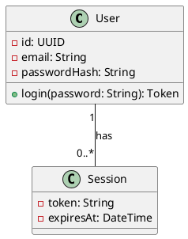
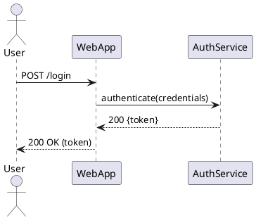
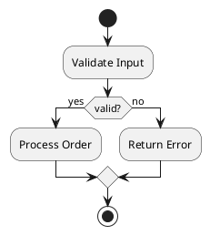
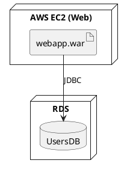
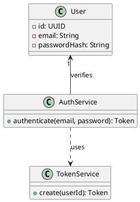
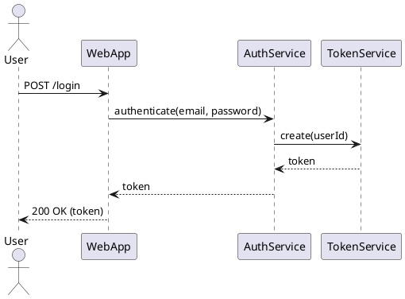
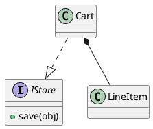
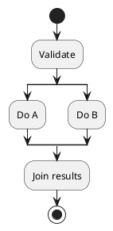
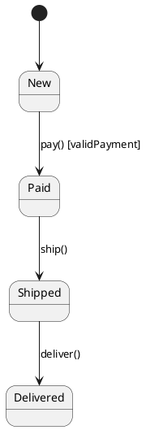

# UML Diagrams

---

> A comprehensive, practical guide to UML (Unified Modeling Language) diagrams: notation, purpose, examples (PlantUML), modeling tips, and best practices for software design and documentation.

---

## Table of Contents

1. Overview
2. When to use UML
3. Core UML Diagram Types (quick map)
4. Class Diagrams — In-depth
5. Sequence Diagrams — In-depth
6. Use Case Diagrams
7. Activity Diagrams
8. State Machine Diagrams
9. Component & Deployment Diagrams
10. Object, Package, Communication, Timing Diagrams (summary)
11. Relationships & Notation Reference
12. Stereotypes, Tagged Values, Constraints
13. Modeling Best Practices
14. Example: Design Walkthrough (User Login)
15. PlantUML cheat-sheet (runnable snippets)
16. Tools & Integration
17. README Checklist & Versioning
18. License

---

## 1. Overview

UML (Unified Modeling Language) is a standardized visual language for modeling the structure and behavior of systems. It helps teams communicate architecture, design decisions, flows, and constraints. UML is not a programming language — it's a communication tool that should be kept in sync with code and documentation.

This README gives both conceptual definitions and practical notation. Where helpful, PlantUML examples are included so diagrams can be generated automatically.

## 2. When to use UML

* **Exploration & design**: to model alternatives, tradeoffs, and object responsibilities.
* **Documentation**: high-level architecture for stakeholders and onboarding.
* **Requirement analysis**: use cases and interactions with actors.
* **Testing & QA**: activity/state diagrams to validate behavioral flows.

Avoid overly detailed diagrams that become stale — keep them high value (API, module boundaries, domain model, critical flows).

## 3. Core UML Diagram Types (quick map)

* **Structure (static)**: Class, Component, Deployment, Object, Package
* **Behavior (dynamic)**: Sequence, Activity, State Machine, Use Case
* **Interaction (mix)**: Communication, Timing, Interaction Overview

## 4. Class Diagrams — In-depth

**Purpose:** show classes, attributes, operations, and relationships.

### Elements

* **Class box**: `ClassName` / attributes / methods
* **Visibility**: `+` public, `-` private, `#` protected, `~` package
* **Attributes**: `name: Type [multiplicity] {property}`
* **Operations**: `operation(param: Type): ReturnType {constraints}`

### Relationships

* **Association** — solid line. optionally named, with multiplicity at ends.
* **Directed Association** — arrowhead
* **Aggregation** — hollow diamond (shared whole-part)
* **Composition** — filled diamond (strong ownership)
* **Generalization (inheritance)** — hollow triangle arrow to parent
* **Realization** — dashed line with hollow triangle (interface)
* **Dependency** — dashed arrow (uses)

### Multiplicity examples

* `1`, `0..1`, `*` (many), `1..*`, `0..*`

### Example (PlantUML)

### Design tips

* Model behavior in methods sparingly — prefer Sequence/Activity diagrams for complex logic.
* Keep class diagrams at domain-model level (entities, value objects, aggregates).

## 5. Sequence Diagrams — In-depth

**Purpose:** show time-ordered interactions between objects/actors.

### Elements

* **Lifeline** — vertical dashed line for an instance/actor
* **Synchronous message** — solid arrow (call)
* **Return message** — dashed arrow back
* **Asynchronous message** — open arrow or special notation
* **Activation bar** — thin rectangle on lifeline showing control
* **Fragments** — `alt` (alternatives), `opt` (optional), `loop`, `par` (parallel)

### Example (PlantUML)

### Tips

* Use sequence diagrams to explain algorithms spanning multiple objects or services.
* Limit lifelines to relevant participants.

## 6. Use Case Diagrams

**Purpose:** show actors and high-level system capabilities (use cases).

* Actors: stick figures or named roles
* Use Cases: ovals with brief verbs (e.g., *Place Order*)
* Relationships: `include`, `extend` (dashed arrows)

Use case diagrams are great during requirements elicitation and stakeholder alignment.

## 7. Activity Diagrams

**Purpose:** model workflows, parallelism, decision points.

Key nodes:

* **Initial node** (solid filled circle)
* **Activity** (rounded rectangle)
* **Decision/Merge** (diamond)
* **Fork/Join** (thick bar for parallel flow)
* **Final node** (bullseye)

Good for: business processes, user flows, backend jobs, retry/error handling.

Example:

## 8. State Machine Diagrams

**Purpose:** show lifecycle of an entity (states, transitions, events, actions).

Elements:

* States (rounded boxes), transitions (arrows) labeled with `event [guard] / action`.
* Entry/exit actions, internal transitions.

Example: Order lifecycle — `New -> Paid -> Shipped -> Delivered` with transitions on events.

## 9. Component & Deployment Diagrams

**Component Diagram** — shows module boundaries and provided/required interfaces.

* Useful to describe microservices, libraries, plugins.

**Deployment Diagram** — shows physical nodes (servers, containers) and artifact deployments.

* Nodes, artifacts, communication paths.

Example (Deployment):

## 10. Object, Package, Communication, Timing Diagrams (summary)

* **Object diagrams**: snapshot of instances at a moment in time (like class diagram but for objects).
* **Package diagrams**: organize model into packages/namespaces.
* **Communication diagrams**: alternative to sequence diagrams emphasizing links and message numbering.
* **Timing diagrams**: show change of state/condition over time (useful for embedded systems).

## 11. Relationships & Notation Reference

| Symbol     |                 Name | Meaning                           |                          |
| ---------- | -------------------: | --------------------------------- | ------------------------ |
| `----`     |          Association | Structural link between instances |                          |
| `-->`      | Directed Association | Navigable association             |                          |
| `<>--`     |          Aggregation | Whole-part (shared)               |                          |
| `◆` filled |          Composition | Strong ownership, lifecycle tied  |                          |
| \`--       |                  >\` | Generalization                    | Inheritance              |
| \`..       |                  >\` | Realization                       | Interface implementation |
| `..>`      |           Dependency | Uses (loosely coupled)            |                          |

Multiplicity, qualifiers, and role names should be shown near association ends.

## 12. Stereotypes, Tagged Values, Constraints

* **Stereotype**: `<<stereotype>>` — adds semantic meaning (e.g., `<<entity>>`, `<<controller>>`).
* **Tagged values**: `{key=value}` — metadata for model elements.
* **Constraints**: `[invariant]` or `{constraint}` — OCL or natural language restrictions.

Use them judiciously — too many custom stereotypes reduce readability.

## 13. Modeling Best Practices

* **Purpose-first**: pick the diagram type for the question you want to answer.
* **Keep diagrams focused**: 1 concern per diagram (domain model, auth flow, deployment, etc.).
* **Use naming conventions**: consistent class/operation/actor names.
* **Version diagrams** along with code (git or diagram files). Keep a small number of canonical diagrams.
* **Prefer PlantUML or similar**: text-based diagrams are versionable and easy to regenerate.
* **Annotate with rationale**: short notes explaining non-obvious decisions.

## 14. Example: Design Walkthrough — User Login (class + sequence)

**Domain classes**: `User`, `AuthService`, `TokenService`, `Session`.

*Class diagram (PlantUML):*

*Sequence diagram (PlantUML):*

## 15. PlantUML cheat-sheet (runnable snippets)

### Class with interface + composition

### Activity with parallel flows

### State chart with guards

## 16. Tools & Integration

* **PlantUML**: text-based, supports many UML types. Use with `plantuml.jar`, VSCode extension, or online renderers.
* **Mermaid**: simpler syntax (supports class, sequence, state, flowcharts). Nice for Markdown integration (GitHub, GitLab).
* **Draw\.io / Diagrams.net**: GUI-based, good for ad-hoc diagrams.
* **Lucidchart / Visio**: enterprise GUI tools with collaboration.
* **Structurizr**: C4 model complement for architecture diagrams.

Integration tips:

* Check if your docs host supports PlantUML or Mermaid rendering.
* Keep `.puml` files in a `diagrams/` folder and add an automated CI step to render PNG/SVG.

## 17. README Checklist & Versioning

* [ ] Do diagrams answer stakeholder questions?
* [ ] Keep domain model under version control
* [ ] Add small README.md atop `diagrams/` describing each diagram's purpose
* [ ] Automate rendering in CI (optional)

Version diagram files with the same semver used by your project and record the date of last update.

## 18. License

This document is provided under the MIT License. Reuse and modify freely.

---

**End of README — UML Diagrams (comprehensive)**
